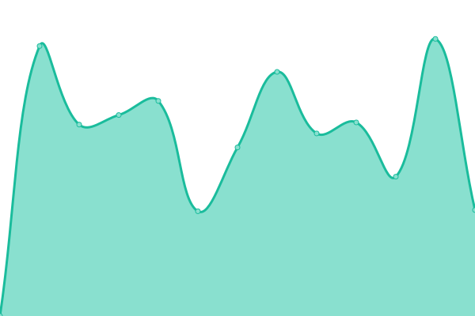

# [📈 Live Status](https://demo.upptime.js.org): <!--live status--> **🟧 Partial outage**

This repository contains the open-source uptime monitor and status page for [Upptime](https://upptime.js.org), powered by [Upptime](https://github.com/upptime/upptime).

With [Upptime](https://upptime.js.org), you can get your own unlimited and free uptime monitor and status page, powered entirely by a GitHub repository. We use [Issues](https://github.com/upptime/upptime/issues) as incident reports, [Actions](https://github.com/pellit/control_uptime/actions) as uptime monitors, and [Pages](https://demo.upptime.js.org) for the status page.

<!--start: status pages-->
<!-- This summary is generated by Upptime (https://github.com/upptime/upptime) -->
<!-- Do not edit this manually, your changes will be overwritten -->
<!-- prettier-ignore -->
| URL | Status | History | Response Time | Uptime |
| --- | ------ | ------- | ------------- | ------ |
|  [Musicaunr.info](https://musicaunr.info) | 🟩 Up | [musicaunr-info.yml](https://github.com/pellit/control_uptime/commits/HEAD/history/musicaunr-info.yml) | 

 3255ms
     
 | 

<a href="https://demo.upptime.js.org/history/musicaunr-info">100.00%</a>
    

|  [Pellit](https://pellit.com.ar/) | 🟩 Up | [pellit.yml](https://github.com/pellit/control_uptime/commits/HEAD/history/pellit.yml) | 

 1983ms
     
 | 

<a href="https://demo.upptime.js.org/history/pellit">100.00%</a>
    

|  [Grafana_panel](http://201.253.22.2:3000/login) | 🟥 Down | [grafana-panel.yml](https://github.com/pellit/control_uptime/commits/HEAD/history/grafana-panel.yml) | 

 829ms
     
 | 

<a href="https://demo.upptime.js.org/history/grafana-panel">96.89%</a>
    

|  [Server_online](http://201.253.22.2:9999) | 🟩 Up | [server-online.yml](https://github.com/pellit/control_uptime/commits/HEAD/history/server-online.yml) | 

 910ms
     
 | 

<a href="https://demo.upptime.js.org/history/server-online">96.28%</a>
    

<!--end: status pages-->

[**Visit our status website →**](https://pellit.github.io/control_uptime/)

## 📄 License

- Powered by: [Upptime](https://github.com/upptime/upptime)
- Code: [MIT](./LICENSE) © [Upptime](https://upptime.js.org)
- Data in the `./history` directory: [Open Database License](https://opendatacommons.org/licenses/odbl/1-0/)
