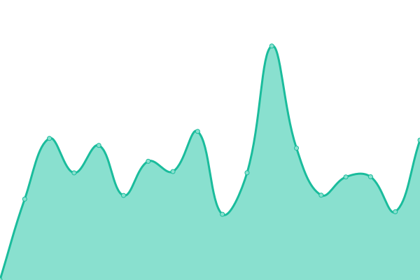

# [📈 PELLIT - Live Status](https://pellit.github.io/control_uptime/): <!--live status--> **🟩 All systems operational**

This repository contains the open-source uptime monitor and status page for [Upptime](https://upptime.js.org), powered by [Upptime](https://github.com/upptime/upptime).

We use [Issues](https://github.com/upptime/upptime/issues) as incident reports, [Actions](https://github.com/pellit/control_uptime/actions) as uptime monitors, and [Pages](https://github.com/pellit/control_uptime) for the status page.

<!--start: status pages-->
<!-- This summary is generated by Upptime (https://github.com/upptime/upptime) -->
<!-- Do not edit this manually, your changes will be overwritten -->
<!-- prettier-ignore -->
| URL | Status | History | Response Time | Uptime |
| --- | ------ | ------- | ------------- | ------ |
|  MU-PAGE | 🟩 Up | [mu-page.yml](https://github.com/pellit/control_uptime/commits/HEAD/history/mu-page.yml) | 

 2769ms
     
 | 

<a href="https://Pellit.github.io/control_uptime/history/mu-page">99.87%</a>
    

|  [PELLIT-PAGE](https://pellit.com.ar/) | 🟩 Up | [pellit-page.yml](https://github.com/pellit/control_uptime/commits/HEAD/history/pellit-page.yml) | 

 1839ms
     
 | 

<a href="https://Pellit.github.io/control_uptime/history/pellit-page">99.87%</a>
    

|  HOSS-PAGE | 🟩 Up | [hoss-page.yml](https://github.com/pellit/control_uptime/commits/HEAD/history/hoss-page.yml) | 

 699ms
     
 | 

<a href="https://Pellit.github.io/control_uptime/history/hoss-page">100.00%</a>
    

|  GR-GRA | 🟩 Up | [gr-gra.yml](https://github.com/pellit/control_uptime/commits/HEAD/history/gr-gra.yml) | 

 1011ms
     
 | 

<a href="https://Pellit.github.io/control_uptime/history/gr-gra">99.04%</a>
    

|  GR-Server | 🟩 Up | [gr-server.yml](https://github.com/pellit/control_uptime/commits/HEAD/history/gr-server.yml) | 

 1059ms
     
 | 

<a href="https://Pellit.github.io/control_uptime/history/gr-server">98.79%</a>
    

|  PELLIT_TA | 🟩 Up | [pellit-ta.yml](https://github.com/pellit/control_uptime/commits/HEAD/history/pellit-ta.yml) | 

 292ms
     
 | 

<a href="https://Pellit.github.io/control_uptime/history/pellit-ta">100.00%</a>
    

<!--end: status pages-->

[**Visit our status website →**](https://pellit.github.io/control_uptime/)

## 📄 License

- Powered by: [Upptime](https://github.com/upptime/upptime)
- Code: [MIT](./LICENSE) © [Upptime](https://upptime.js.org)
- Data in the `./history` directory: [Open Database License](https://opendatacommons.org/licenses/odbl/1-0/)
